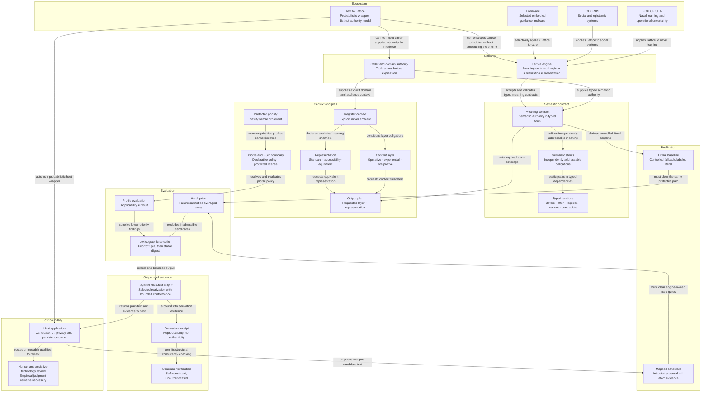

<!-- Generated file. Edit the authoritative JSON register, then run the builder. -->

# Lattice concept and ecosystem map

A typed map of the upstream Lattice engine: who supplies authority, how meaning becomes a bounded output plan, how candidates clear protected gates, and where hosts and ecosystem applications remain responsible.

[Open the interactive HTML edition](https://hah.dev/documentation/text-to-lattice/lattice-concept-map.html) · [Download complete Markdown](https://hah.dev/documentation/text-to-lattice/LATTICE-CONCEPT-MAP.md) · [Download the machine-readable register](https://hah.dev/documentation/text-to-lattice/documentation-atlas.json) · [Inspect the artifact manifest](https://hah.dev/documentation/text-to-lattice/artifact-manifest.json)

## Authority and claim boundary

This register describes the Lattice method at an architectural level and the bounded Text to Lattice implementation evidenced in this repository. It does not redistribute the exclusive register profile, certify universal conformance, or convert source tests into deployed proof.

Stable identifiers persist. A claim changes here with cited evidence; a rendered filter, expansion, or downloaded view never changes authoritative state.

Markdown and HTML are deterministic projections of this register. Filtered browser exports are nonauthoritative reading views.

## Typed map

The diagram is a reading surface. The concept register and complete relation table below are the canonical text equivalent; visual proximity carries no authority.

## Concept register

### Authority

The caller and domain sources that establish meaning before expression.

<strong>LAT-N-000</strong> · Lattice engine — Meaning contract ≠ register ≠ realization ≠ presentation

A local-first deterministic TypeScript engine that realizes and validates context-sensitive plain text from typed meaning, explicit context, declarative profiles, and traceable candidates.

- **Group:** Authority
- **Authority:** Reviewed upstream architecture at d6cc85b
- **Perspectives:** engine, assurance, host, ecosystem
- **Sources:** SRC-LAT-README, SRC-LAT-ARCH, SRC-LAT-ENGINE
- **Typed relations:** LAT-N-022 → applies Lattice to naval learning → LAT-N-000 (LAT-E-025); LAT-N-023 → applies Lattice to social systems → LAT-N-000 (LAT-E-026); LAT-N-024 → selectively applies Lattice to care → LAT-N-000 (LAT-E-027); LAT-N-021 → demonstrates Lattice principles without embedding the engine → LAT-N-000 (LAT-E-029); LAT-N-000 → accepts and validates typed meaning contracts → LAT-N-002 (LAT-E-028)

<strong>LAT-N-001</strong> · Caller and domain authority — Truth enters before expression

The caller supplies structured claims, terminology, context, candidate provenance, and domain attestations. Lattice does not infer source truth, authority, or missing high-priority context.

- **Group:** Authority
- **Authority:** Meaning and host trust boundary
- **Perspectives:** engine, host, assurance
- **Sources:** SRC-LAT-README, SRC-LAT-ARCH, SRC-LAT-REQ
- **Typed relations:** LAT-N-021 → cannot inherit caller-supplied authority by inference → LAT-N-001 (LAT-E-024); LAT-N-001 → supplies typed semantic authority → LAT-N-002 (LAT-E-001); LAT-N-001 → supplies explicit domain and audience context → LAT-N-005 (LAT-E-004)

### Semantic contract

Typed atoms and relations that make preservation testable.

<strong>LAT-N-002</strong> · Meaning contract — Semantic authority in typed form

A bounded contract gives each semantic obligation a stable identity, frame, criticality, delivery policy, protected fields, permitted evidence, and prohibited dependencies.

- **Group:** Semantic contract
- **Authority:** Validated contract model
- **Perspectives:** engine, assurance
- **Sources:** SRC-LAT-ARCH, SRC-LAT-SEMANTIC
- **Typed relations:** LAT-N-001 → supplies typed semantic authority → LAT-N-002 (LAT-E-001); LAT-N-000 → accepts and validates typed meaning contracts → LAT-N-002 (LAT-E-028); LAT-N-002 → defines independently addressable meaning → LAT-N-003 (LAT-E-002); LAT-N-002 → sets required atom coverage → LAT-N-010 (LAT-E-010); LAT-N-002 → derives controlled literal baseline → LAT-N-012 (LAT-E-012)

<strong>LAT-N-003</strong> · Semantic atoms — Independently addressable obligations

Actions, states, timings, conditions, consequences, prohibitions, uncertainties, recovery steps, and relations carry structured subjects, predicates, objects, polarity, modality, value, unit, and condition references.

- **Group:** Semantic contract
- **Authority:** Semantic core
- **Perspectives:** engine, assurance
- **Sources:** SRC-LAT-SEMANTIC, SRC-LAT-REQ
- **Typed relations:** LAT-N-002 → defines independently addressable meaning → LAT-N-003 (LAT-E-002); LAT-N-003 → participates in typed dependencies → LAT-N-004 (LAT-E-003)

<strong>LAT-N-004</strong> · Typed relations — Before · after · requires · causes · contradicts

Relations connect existing atoms and make protected order, dependency, causality, and contradiction explicit; unresolved references, invalid self-links, and incoherent cycles fail closed.

- **Group:** Semantic contract
- **Authority:** Semantic core
- **Perspectives:** engine, assurance
- **Sources:** SRC-LAT-SEMANTIC, SRC-LAT-ADVERSARIAL
- **Typed relations:** LAT-N-003 → participates in typed dependencies → LAT-N-004 (LAT-E-003)

### Context and plan

Explicit context, content layers, representations, priorities, and requested outputs.

<strong>LAT-N-005</strong> · Register context — Explicit, never ambient

Domain, surface, mode, stakes, safety class, locale, audience, focalizer, channel capabilities, and execution limits arrive as validated input rather than time, locale, identity, network, or prior-run inference.

- **Group:** Context and plan
- **Authority:** Context core
- **Perspectives:** engine, host
- **Sources:** SRC-LAT-CONTEXT, SRC-LAT-ARCH
- **Typed relations:** LAT-N-001 → supplies explicit domain and audience context → LAT-N-005 (LAT-E-004); LAT-N-005 → conditions layer obligations → LAT-N-006 (LAT-E-005); LAT-N-005 → declares available meaning channels → LAT-N-007 (LAT-E-006)

<strong>LAT-N-006</strong> · Content layer — Operative · experiential · interpretive

A requested layer determines which atoms must be explicit or may be inferable, while experiential and interpretive emphasis cannot contradict or conceal operative meaning.

- **Group:** Context and plan
- **Authority:** Layer contract
- **Perspectives:** engine, host, ecosystem
- **Sources:** SRC-LAT-README, SRC-LAT-CONTEXT, SRC-LAT-REQ
- **Typed relations:** LAT-N-005 → conditions layer obligations → LAT-N-006 (LAT-E-005); LAT-N-006 → requests content treatment → LAT-N-010 (LAT-E-008)

<strong>LAT-N-007</strong> · Representation — Standard · accessibility-equivalent

Accessibility is another realization of the same relevant atoms, not a fourth narrative layer. Essential meaning cannot depend on unavailable imagery, color, sound, spatial inference, timing perception, or implication.

- **Group:** Context and plan
- **Authority:** Representation and parity contract
- **Perspectives:** engine, assurance, host
- **Sources:** SRC-LAT-README, SRC-LAT-CONTEXT, SRC-LAT-ARCH
- **Typed relations:** LAT-N-005 → declares available meaning channels → LAT-N-007 (LAT-E-006); LAT-N-007 → requests equivalent representation → LAT-N-010 (LAT-E-009)

<strong>LAT-N-008</strong> · Protected priority — Safety before ornament

Safety, semantic fidelity, accessibility equivalence, required operative clarity, and authoritative domain correctness are hard gates that profile style and ranking cannot outweigh.

- **Group:** Context and plan
- **Authority:** Engine-owned policy
- **Perspectives:** engine, assurance
- **Sources:** SRC-LAT-README, SRC-LAT-REQ, SRC-LAT-ENGINE
- **Typed relations:** LAT-N-008 → reserves priorities profiles cannot redefine → LAT-N-009 (LAT-E-007)

<strong>LAT-N-009</strong> · Profile and RSR boundary — Declarative policy · protected license

Profiles declare bounded predicates, validators, dependencies, conflicts, and lower-priority policy without executable transforms. The bundled Relational Systems Register remains separately licensed and is not reproduced here.

- **Group:** Context and plan
- **Authority:** Profile compiler and license boundary
- **Perspectives:** engine, assurance, host
- **Sources:** SRC-LAT-PROFILE, SRC-LAT-README, SRC-LAT-REQ
- **Typed relations:** LAT-N-008 → reserves priorities profiles cannot redefine → LAT-N-009 (LAT-E-007); LAT-N-009 → resolves and evaluates profile policy → LAT-N-014 (LAT-E-015)

<strong>LAT-N-010</strong> · Output plan — Requested layer × representation

Normalized outputs are unique, ordered layer-and-representation pairs; accessibility equivalents pull in their standard pair, and safety-critical contexts require both operative representations.

- **Group:** Context and plan
- **Authority:** Context normalization
- **Perspectives:** engine, host
- **Sources:** SRC-LAT-CONTEXT, SRC-LAT-ENGINE
- **Typed relations:** LAT-N-006 → requests content treatment → LAT-N-010 (LAT-E-008); LAT-N-007 → requests equivalent representation → LAT-N-010 (LAT-E-009); LAT-N-002 → sets required atom coverage → LAT-N-010 (LAT-E-010)

### Realization

Mapped proposals and the controlled literal baseline.

<strong>LAT-N-011</strong> · Mapped candidate — Untrusted proposal with atom evidence

A host may propose bounded plain text, atom identifiers, and validation metadata. Candidate order and source do not authorize selection; unknown mappings and invented claims remain rejectable.

- **Group:** Realization
- **Authority:** Candidate boundary
- **Perspectives:** engine, assurance, host
- **Sources:** SRC-LAT-ARCH, SRC-LAT-ENGINE, SRC-LAT-ADVERSARIAL
- **Typed relations:** LAT-N-019 → proposes mapped candidate text → LAT-N-011 (LAT-E-011); LAT-N-011 → must clear engine-owned hard gates → LAT-N-013 (LAT-E-013)

<strong>LAT-N-012</strong> · Literal baseline — Controlled fallback, labeled literal

When no mapped candidate targets an output, the engine constructs a deterministic realization from controlled literal forms or structured frames and never labels it full conformance.

- **Group:** Realization
- **Authority:** Current realization boundary
- **Perspectives:** engine, assurance
- **Sources:** SRC-LAT-README, SRC-LAT-SEMANTIC, SRC-LAT-ADVERSARIAL
- **Typed relations:** LAT-N-002 → derives controlled literal baseline → LAT-N-012 (LAT-E-012); LAT-N-012 → must clear the same protected path → LAT-N-013 (LAT-E-014)

### Evaluation

Engine gates, profile decisions, and deterministic selection.

<strong>LAT-N-013</strong> · Hard gates — Failure cannot be averaged away

Engine-owned checks reject uncovered atoms, protected drift, changed polarity or modality, quantity or unit change, unsafe dependencies, layer contradiction, accessibility gaps, and other registered structural failures.

- **Group:** Evaluation
- **Authority:** Validator and engine contract
- **Perspectives:** engine, assurance
- **Sources:** SRC-LAT-ENGINE, SRC-LAT-REQ, SRC-LAT-ADVERSARIAL
- **Typed relations:** LAT-N-011 → must clear engine-owned hard gates → LAT-N-013 (LAT-E-013); LAT-N-012 → must clear the same protected path → LAT-N-013 (LAT-E-014); LAT-N-013 → excludes inadmissible candidates → LAT-N-015 (LAT-E-016)

<strong>LAT-N-014</strong> · Profile evaluation — Applicability ≠ result

Each rule records applied, suppressed, or inapplicable separately from pass, warn, fail, unknown, or not-applicable, so nonexecution cannot masquerade as satisfaction.

- **Group:** Evaluation
- **Authority:** Profile resolution
- **Perspectives:** engine, assurance
- **Sources:** SRC-LAT-PROFILE, SRC-LAT-ENGINE, SRC-LAT-REQ
- **Typed relations:** LAT-N-009 → resolves and evaluates profile policy → LAT-N-014 (LAT-E-015); LAT-N-014 → supplies lower-priority findings → LAT-N-015 (LAT-E-017)

<strong>LAT-N-015</strong> · Lexicographic selection — Priority tuple, then stable digest

Admissible candidates are ranked lexicographically by protected priority, conformance, registered findings, and stable tie-break evidence; a stylistic gain cannot compensate for a hard failure.

- **Group:** Evaluation
- **Authority:** Deterministic engine selection
- **Perspectives:** engine, assurance
- **Sources:** SRC-LAT-ENGINE, SRC-LAT-ARCH, SRC-LAT-ADVERSARIAL
- **Typed relations:** LAT-N-013 → excludes inadmissible candidates → LAT-N-015 (LAT-E-016); LAT-N-014 → supplies lower-priority findings → LAT-N-015 (LAT-E-017); LAT-N-015 → selects one bounded output → LAT-N-016 (LAT-E-018)

### Output and evidence

Plain-text results, receipts, and structural verification.

<strong>LAT-N-016</strong> · Layered plain-text output — Selected realization with bounded conformance

Each output exposes its layer, representation, text, atom mapping, candidate source, conformance, coverage, findings, and rule decisions; the host still owns presentation.

- **Group:** Output and evidence
- **Authority:** Public result structure
- **Perspectives:** engine, host, ecosystem
- **Sources:** SRC-LAT-ENGINE, SRC-LAT-ARCH
- **Typed relations:** LAT-N-015 → selects one bounded output → LAT-N-016 (LAT-E-018); LAT-N-016 → is bound into derivation evidence → LAT-N-017 (LAT-E-019); LAT-N-016 → returns plain text and evidence to host → LAT-N-019 (LAT-E-021)

<strong>LAT-N-017</strong> · Derivation receipt — Reproducibility, not authenticity

A canonical receipt binds input, engine and profile versions, outputs, candidates, decisions, assurance scope, and derivation digest without claiming that facts or history are authentic.

- **Group:** Output and evidence
- **Authority:** Evidence contract
- **Perspectives:** engine, assurance, host
- **Sources:** SRC-LAT-ENGINE, SRC-LAT-README, SRC-LAT-ARCH
- **Typed relations:** LAT-N-016 → is bound into derivation evidence → LAT-N-017 (LAT-E-019); LAT-N-017 → permits structural consistency checking → LAT-N-018 (LAT-E-020)

<strong>LAT-N-018</strong> · Structural verification — Self-consistent, unauthenticated

Receipt and result verification reject unsupported schemas, broken references, altered aggregates, and digest tampering while reporting that integrity is self-consistent and not externally authenticated.

- **Group:** Output and evidence
- **Authority:** Receipt verifier
- **Perspectives:** assurance, host
- **Sources:** SRC-LAT-ENGINE, SRC-LAT-ADVERSARIAL
- **Typed relations:** LAT-N-017 → permits structural consistency checking → LAT-N-018 (LAT-E-020)

### Host boundary

Presentation, source quality, privacy, and human review that stay outside the engine.

<strong>LAT-N-019</strong> · Host application — Candidate, UI, privacy, and persistence owner

The host owns domain-source quality, mapped candidate production, sanitization, rendering, storage consent, privacy, interface accessibility, and any claims beyond the engine's declared trust scope.

- **Group:** Host boundary
- **Authority:** Host responsibility boundary
- **Perspectives:** host, ecosystem, assurance
- **Sources:** SRC-LAT-ARCH, SRC-LAT-README
- **Typed relations:** LAT-N-016 → returns plain text and evidence to host → LAT-N-019 (LAT-E-021); LAT-N-021 → acts as a probabilistic host wrapper → LAT-N-019 (LAT-E-023); LAT-N-019 → proposes mapped candidate text → LAT-N-011 (LAT-E-011); LAT-N-019 → routes unprovable qualities to review → LAT-N-020 (LAT-E-022)

<strong>LAT-N-020</strong> · Human and assistive-technology review — Empirical judgment remains necessary

Disabled users, assistive technologies, domain reviewers, and editors test accessibility, comprehension, truth, moral adequacy, and literary quality that deterministic structure cannot prove.

- **Group:** Host boundary
- **Authority:** Known limitation and review boundary
- **Perspectives:** host, assurance
- **Sources:** SRC-LAT-README, SRC-LAT-ARCH, SRC-LAT-REQ
- **Typed relations:** LAT-N-019 → routes unprovable qualities to review → LAT-N-020 (LAT-E-022)

### Ecosystem

Products that apply or interpret Lattice under their own contracts.

<strong>LAT-N-021</strong> · Text to Lattice — Probabilistic wrapper, distinct authority model

The hah.dev demonstrator infers a bounded contract from prose with local models and independent checks. It does not inherit the upstream engine's typed caller-authority guarantee and must state its weaker semantic boundary separately.

- **Group:** Ecosystem
- **Authority:** Wrapper claim boundary
- **Perspectives:** ecosystem, host, assurance
- **Sources:** SRC-REQUIREMENTS, SRC-DEMO, SRC-PROJECTS
- **Typed relations:** LAT-N-021 → acts as a probabilistic host wrapper → LAT-N-019 (LAT-E-023); LAT-N-021 → cannot inherit caller-supplied authority by inference → LAT-N-001 (LAT-E-024); LAT-N-021 → demonstrates Lattice principles without embedding the engine → LAT-N-000 (LAT-E-029)

<strong>LAT-N-022</strong> · FOG OF SEA — Naval learning and operational uncertainty

A host context that applies Lattice to naval learning, operational uncertainty, and accessible tactical interaction under its own domain and evidence responsibilities.

- **Group:** Ecosystem
- **Authority:** Portfolio ecosystem register
- **Perspectives:** ecosystem
- **Sources:** SRC-PROJECTS
- **Typed relations:** LAT-N-022 → applies Lattice to naval learning → LAT-N-000 (LAT-E-025)

<strong>LAT-N-023</strong> · CHORUS — Social and epistemic systems

A host context that applies Lattice to social and epistemic systems while retaining its own simulation, claim, accessibility, and evidence boundaries.

- **Group:** Ecosystem
- **Authority:** Portfolio ecosystem register
- **Perspectives:** ecosystem
- **Sources:** SRC-PROJECTS
- **Typed relations:** LAT-N-023 → applies Lattice to social systems → LAT-N-000 (LAT-E-026)

<strong>LAT-N-024</strong> · Evenward — Selected embodied guidance and care

A host context that selectively applies Lattice to embodied guidance and care while remaining responsible for safety, privacy, presentation, and human validation.

- **Group:** Ecosystem
- **Authority:** Portfolio ecosystem register
- **Perspectives:** ecosystem
- **Sources:** SRC-PROJECTS
- **Typed relations:** LAT-N-024 → selectively applies Lattice to care → LAT-N-000 (LAT-E-027)

## Complete relation register

| ID | Source | Relation | Target | Kind |
| --- | --- | --- | --- | --- |
| LAT-E-001 | LAT-N-001 | supplies typed semantic authority | LAT-N-002 | supplies |
| LAT-E-002 | LAT-N-002 | defines independently addressable meaning | LAT-N-003 | defines |
| LAT-E-003 | LAT-N-003 | participates in typed dependencies | LAT-N-004 | relates |
| LAT-E-004 | LAT-N-001 | supplies explicit domain and audience context | LAT-N-005 | supplies |
| LAT-E-005 | LAT-N-005 | conditions layer obligations | LAT-N-006 | constrains |
| LAT-E-006 | LAT-N-005 | declares available meaning channels | LAT-N-007 | constrains |
| LAT-E-007 | LAT-N-008 | reserves priorities profiles cannot redefine | LAT-N-009 | constrains |
| LAT-E-008 | LAT-N-006 | requests content treatment | LAT-N-010 | requests |
| LAT-E-009 | LAT-N-007 | requests equivalent representation | LAT-N-010 | requests |
| LAT-E-010 | LAT-N-002 | sets required atom coverage | LAT-N-010 | constrains |
| LAT-E-011 | LAT-N-019 | proposes mapped candidate text | LAT-N-011 | proposes |
| LAT-E-012 | LAT-N-002 | derives controlled literal baseline | LAT-N-012 | derives |
| LAT-E-013 | LAT-N-011 | must clear engine-owned hard gates | LAT-N-013 | validates |
| LAT-E-014 | LAT-N-012 | must clear the same protected path | LAT-N-013 | validates |
| LAT-E-015 | LAT-N-009 | resolves and evaluates profile policy | LAT-N-014 | evaluates |
| LAT-E-016 | LAT-N-013 | excludes inadmissible candidates | LAT-N-015 | constrains |
| LAT-E-017 | LAT-N-014 | supplies lower-priority findings | LAT-N-015 | ranks |
| LAT-E-018 | LAT-N-015 | selects one bounded output | LAT-N-016 | derives |
| LAT-E-019 | LAT-N-016 | is bound into derivation evidence | LAT-N-017 | records |
| LAT-E-020 | LAT-N-017 | permits structural consistency checking | LAT-N-018 | verifies |
| LAT-E-021 | LAT-N-016 | returns plain text and evidence to host | LAT-N-019 | integrates |
| LAT-E-022 | LAT-N-019 | routes unprovable qualities to review | LAT-N-020 | integrates |
| LAT-E-023 | LAT-N-021 | acts as a probabilistic host wrapper | LAT-N-019 | integrates |
| LAT-E-024 | LAT-N-021 | cannot inherit caller-supplied authority by inference | LAT-N-001 | constrains |
| LAT-E-025 | LAT-N-022 | applies Lattice to naval learning | LAT-N-000 | applies |
| LAT-E-026 | LAT-N-023 | applies Lattice to social systems | LAT-N-000 | applies |
| LAT-E-027 | LAT-N-024 | selectively applies Lattice to care | LAT-N-000 | applies |
| LAT-E-028 | LAT-N-000 | accepts and validates typed meaning contracts | LAT-N-002 | validates |
| LAT-E-029 | LAT-N-021 | demonstrates Lattice principles without embedding the engine | LAT-N-000 | applies |

## Reading and maintenance rules

- Caller and domain authority precede expression; a fluent candidate cannot manufacture authority.
- Hard gates exclude a candidate before profile preference or ornament is considered.
- A receipt proves structural self-consistency under recorded versions, not truth or authenticity.
- Text to Lattice is an ecosystem wrapper with a probabilistic authority boundary; it does not inherit typed caller-authority guarantees.
- Host applications retain presentation, privacy, storage, domain review, and interface-accessibility duties.

## Source register

- **SRC-REQUIREMENTS — Text to Lattice public requirements:** `docs/lattice-resume-demo-requirements.md`
- **SRC-DEMO — Bounded pipeline coordinator:** `app/resume/latticeDemo.js`
- **SRC-INPUT — Input and clarification policy:** `app/resume/lattice/inputPolicy.js`
- **SRC-SEGMENTS — Lossless segmentation:** `app/resume/lattice/segments.js`
- **SRC-PROTECTED — Protected-span handling:** `app/resume/lattice/protectedSpans.js`
- **SRC-PROMPTS — Closed prompts and schemas:** `app/resume/lattice/promptContract.js`
- **SRC-VALIDATORS — Deterministic semantic validators:** `app/resume/lattice/validators.js`
- **SRC-LOCAL-MODEL — Local model adapter:** `app/resume/lattice/localModel.js`
- **SRC-MODEL-CONTRACT — Pinned model contract:** `app/resume/lattice/modelContract.js`
- **SRC-MODEL-WORKER — Isolated model worker:** `app/resume/lattice/latticeWebllm.worker.ts`
- **SRC-ASSET-POLICY — Model-asset request policy:** `app/resume/lattice/assetRequestPolicy.js`
- **SRC-ATTESTATION — Cross-origin attestation protocol:** `app/resume/lattice/attestation.js`
- **SRC-USAGE-LEASE — Browser lease client:** `app/resume/lattice/usageLease.js`
- **SRC-USAGE-POLICY — Published usage and capacity policy:** `app/resume/lattice/usagePolicy.js`
- **SRC-OUTPUT — Output protection controls:** `app/resume/lattice/outputProtection.js`
- **SRC-LEASE-WORKER — Lease Worker request coordinator:** `workers/text-to-lattice-lease/worker.js`
- **SRC-USAGE-STORAGE — Global usage authority:** `workers/text-to-lattice-lease/usageStorage.js`
- **SRC-FRAME — Dedicated verification bridge:** `workers/text-to-lattice-attestation-frame/public/turnstile/bridge.js`
- **SRC-TEST-ENGINE — Engine executable contracts:** `tests/lattice-demo.test.mjs`
- **SRC-TEST-SECURITY — Security executable contracts:** `tests/lattice-security.test.mjs`
- **SRC-TEST-ISOLATE — Isolate hardening executable contracts:** `tests/lattice-isolate-hardening.test.mjs`
- **SRC-TEST-CAPACITY — Protocol capacity executable contracts:** `tests/lattice-protocol-capacity.test.mjs`
- **SRC-TEST-A11Y — Modal accessibility source contracts:** `tests/lattice-modal-accessibility.test.mjs`
- **SRC-PROJECTS — Portfolio project and ecosystem register:** `app/resume/projects.js`
- **SRC-LAT-README — Lattice README at the reviewed revision:** [Reviewed source](https://github.com/howardhayden/lattice/blob/d6cc85b275e3f14163a5a547f626832fd21b27b0/README.md)
- **SRC-LAT-ARCH — Lattice architecture at the reviewed revision:** [Reviewed source](https://github.com/howardhayden/lattice/blob/d6cc85b275e3f14163a5a547f626832fd21b27b0/docs/architecture.md)
- **SRC-LAT-REQ — Lattice requirements at the reviewed revision:** [Reviewed source](https://github.com/howardhayden/lattice/blob/d6cc85b275e3f14163a5a547f626832fd21b27b0/docs/requirements.md)
- **SRC-LAT-SEMANTIC — Lattice semantic core at the reviewed revision:** [Reviewed source](https://github.com/howardhayden/lattice/blob/d6cc85b275e3f14163a5a547f626832fd21b27b0/src/semantic.ts)
- **SRC-LAT-CONTEXT — Lattice context core at the reviewed revision:** [Reviewed source](https://github.com/howardhayden/lattice/blob/d6cc85b275e3f14163a5a547f626832fd21b27b0/src/context.ts)
- **SRC-LAT-PROFILE — Lattice profile compiler at the reviewed revision:** [Reviewed source](https://github.com/howardhayden/lattice/blob/d6cc85b275e3f14163a5a547f626832fd21b27b0/src/profile.ts)
- **SRC-LAT-ENGINE — Lattice engine at the reviewed revision:** [Reviewed source](https://github.com/howardhayden/lattice/blob/d6cc85b275e3f14163a5a547f626832fd21b27b0/src/engine.ts)
- **SRC-LAT-ADVERSARIAL — Lattice adversarial executable contracts at the reviewed revision:** [Reviewed source](https://github.com/howardhayden/lattice/blob/d6cc85b275e3f14163a5a547f626832fd21b27b0/test/adversarial.test.mjs)
- **SRC-NNG-SKILL — NN/g skill mapping:** [Reviewed source](https://www.nngroup.com/articles/skill-mapping/)
- **SRC-NNG-BLUEPRINT — NN/g service blueprint definition:** [Reviewed source](https://www.nngroup.com/articles/service-blueprints-definition/)
- **SRC-LATTICE-UPSTREAM — Lattice upstream repository:** [Reviewed source](https://github.com/howardhayden/lattice)

## Terms and provenance

Authored documentation follows the hah.dev portfolio-content terms. The generator and executable documentation shell retain the applicable source-component terms. The separately licensed Relational Systems Register profile is not reproduced.
